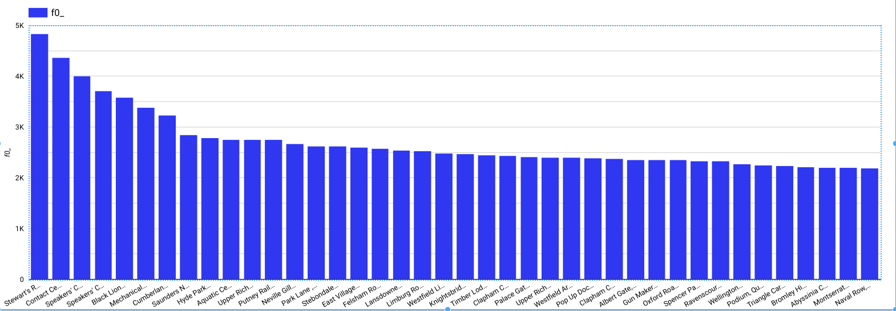
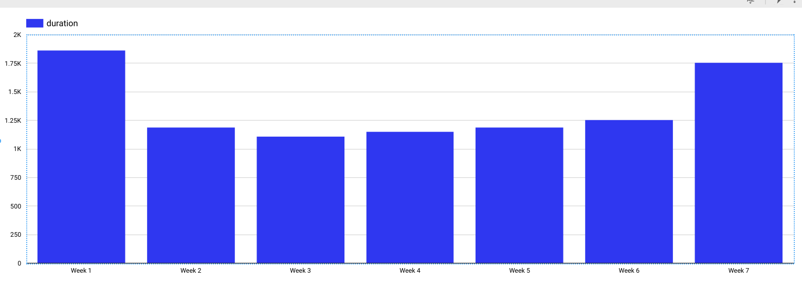
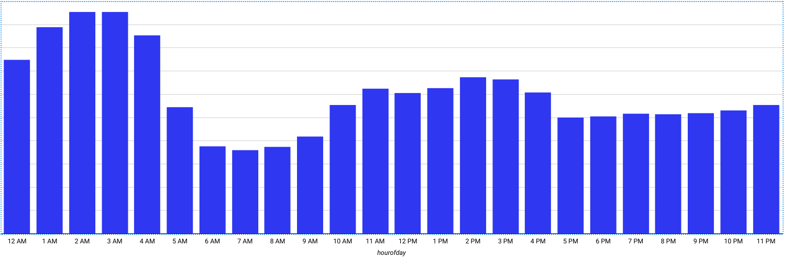
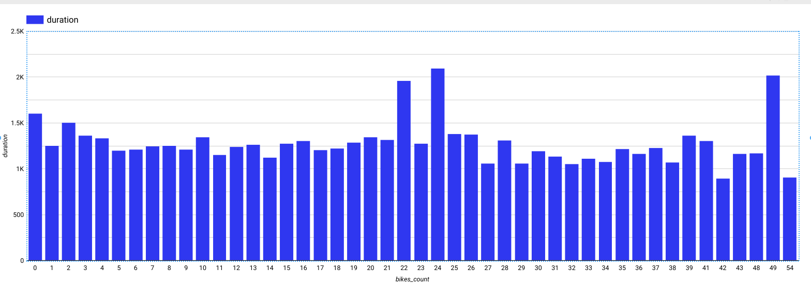

# ml_with_bigquery_personal_notes

My studies and stuff about how to use BigQuery for ML

# 1st things 1st. Basics.

- Regression

    when the label is a number, like estimating the number of tickets that would be sold for a particular movie

- classification

    categorical variables. The probability that a row belongs to a label value.

    - binary classification problems: would buy or wouldn't? 0 or 1
    - multiclass:   the ouput will be a set of probabilities and the sum of them will be 1

- recommender

    it can be done without ml. recommender systems are also the preferable way to address customer targeting problems (to find customers who will like a product or promotional offer)

- clustering

    if we don't have a label at all and we need to do Unsupervised ML

- unstructured data

    we always assume our data consists of structured or semmistructured data. if some of the input features are unstructured (images or natural language text) we should use  Cloud Vision API or Cloud Natural Language 

    ------------------------------------------

## Problem charasteristic                           ML problem type     BigQuery model_type

labels unavaliable and data cannot be labeled       clustering          kmeans

label is a number                                   regression          linear_reg
                                                                        dnn_regressor
                                                                        boosted_tree_regressor

recommend products to users                         recommender         matrix_factorization
recommend users

label is 1/0, true/false or any binary              binary classif      logistic_reg
                                                                        dnn_classifier
                                                                        boosted_tree_classifier

input feature is unstructured                       image classific     ouse output of Clod Vision API or Cloud Natura  
                                                    text classific      natural language PI or any BQ model
                                                    sentiment analysis
                                                    entity extraction

label is unstructured                               question answering  use cloud autoML products
                                                    text summarization
                                                    image captioning

-------------------------------

# Building a Regression model

let's use the london_bicycles dataset

let's assume we have 2 types of bicycles: hardy commuter bikes and fast but fagile road bikes. if a bicycle rental is likely to be for a long duration, we need to have road bikes in stock, but if the rental is likely to be for a short duration, we need to have commuter bikes in stock. Therefore, to build a system to properly stock bicycles, we need to predict the duration of bicycle rentals.

- Choose the label

Because the goal of our first model is to predict the duration of a rental based on our historical dataset of cycle rentals, the label is the duration of the rental.
However, is this the correct objective for the problem? Should we be predictiong the duration of each rental, or should we be predicting the total duration of all rentals at a station over, ofr instance, an hour? If the latter is the better formulation, the label should be the sum of all the rentals in a specific hour. It's just there are a lot of options. Choose carefully your label.

In this case, let's decide we need to build 2 models: one in which we predict the duration of a rental, and the other in which we predict the probability that the rental will be longer than 30 minutes. Then we have the end user make their decission based on the 2 predictions

- Exploring the dataset to find features

Feature engineering is often the most important part of building accurate machine learning models. Good featureengineering requires deep understanding of the data and the domain. It is often a process of hypothesis testing; you have an idea for a feature, you check to see whether it works (has mutual information with the label), and then you add it to the model. If it doesn't work, you try the next idea

- 1st. we'll check all possible features
---------------------

### Impact of station

To check wether the duration of a rental varies by station, you can visualize the result of the following query in Data Studio using t
he start_station_name as the dimension and duration as metric (in google data studio)

        SELECT
        start_station_name,
        AVG( duration)
        FROM
        `bigquery-public-data.london_bicycles.cycle_hire`
        GROUP BY
        start_station_name

Run it and select EXPLORE DATA

f_0 = duration (in seconds), ojo

There are just a few stations that are associated with long-duration rentals (over 3k seconds), but that the majority of station have durations that lie in a relatively narrow range. Had all the stations in London been associated with durations within a narrow range, the station at which the rental commenced would not ahve been a good feature. But in this problem it is demonstrated the start_station_name does matter.

Note that you cannot use end_station_name as feature because at the time the bicycle is being rented, you won't know to chich station the bicycle is going to be returned. Because we are creating a machine learning model to predict events in the future, you need to be mindful of not using any columns that whill not be known at the time the prediciton is made.

### Day of the week

We perform similarly. you can check whether day of week (or hour) matters

        SELECT
        -- dayofweek is a parameter. check it out
        EXTRACT(dayofweek
        FROM
            start_date) AS dayofweek,
        AVG(duration) AS duration
        FROM
        `bigquery-public-data.london_bicycles.cycle_hire`
        GROUP BY
        dayofweek

- It looks like duration are longer on weekends than weekdays. Similarly, durations are longer early in them orning and in the midafternoon, so dayofweek and hourofday are good features

- Number of bicycles

A potential feature is the number of bikes per station

        SELECT
        bikes_count,
        AVG(duration) AS duration
        FROM
        `bigquery-public-data.london_bicycles.cycle_hire` a
        JOIN
        `bigquery-public-data.london_bicycles.cycle_stations` b
        ON
        a.start_station_name = b.name
        GROUP BY
        bikes_count

We can see the relationship is noisy with no visible trend, so the number of bicycles is not a good feature.

----------------------------------------------------
### Remember that for joins you must alias the tables (a,b, for example)

- There's a mathematical way of checking this

        SELECT
        CORR(bikes_count,
            duration) AS CORR
        FROM
        `bigquery-public-data.london_bicycles.cycle_hire` a
        JOIN
        `bigquery-public-data.london_bicycles.cycle_stations` b
        ON
        a.start_station_name = b.name

    Pearson coefficient = -0.0049 which means it's independent. 
    ### (Pearson coefficient goes from 0 to 1, so you can imagine) 

- The Pearson correlation coefficient isn't a perfect test for whether a feature is useful because it looks only at linear dependence. Sometimes a feature might have a nonlinear dependence with the label. Still, the Pearson coefficient is a good starting point. (Maybe it's better to link to Colab and create a correlation Matrix)
------------------------------------------------------------

I'm trying to query from Google Colab and use a proper correlation matrix to evaluate together all features we saw before, but it's taking goddamn time

### Correlation Matrix in Google Colab

        from google.colab import auth
        auth.authenticate_user()
        print('Authenticated')

To use pandas

        %load_ext google.colab.data_table

To query whatever you're querying:

        %%bigquery --project yourprojectid <== CHANGE THIS STUFF!!!

        SELECT
        bikes_count,
        EXTRACT(dayofweek
        FROM
            start_date) AS dayofweek,
        EXTRACT(hour
        FROM
            start_date) AS hourofday,
        AVG(duration) AS duration,
        start_station_name
        FROM
        `bigquery-public-data.london_bicycles.cycle_hire` a
        JOIN
        `bigquery-public-data.london_bicycles.cycle_stations` b
        ON
        a.start_station_name = b.name
        GROUP BY
        bikes_count,
        start_date,
        start_station_name

-------------------------------------------------------------

# Creating a Training Dataset

After taking a glance to the daset, we can prepare the training dataset by pulling out the selected features and the label:

- We do a CAST to transform the date into string. Why we do that? 

#### Feature columns have to be either numeric (INT64, FLOAT64, etc) or categorical (STRING). Datestuff is not allowed. So to prepare the dataset we need to pull out the selected features and label. If the feature is numeric but needs to be treated  as categorical, we need to cast it as a STRING.

        SELECT 
        duration,
        start_station_name,
        CAST(EXTRACT(dayofweek FROM start_date) AS STRING ) as dayofweek,
        CAST(EXTRACT(hour FROM start_date) AS STRING ) as hourofday
        FROM `bigquery-public-data.london_bicycles.cycle_hire` 

If preparing the data involves computationally expensive transformations or joins, it might be a good idea to save the prepared training data as a table so as to not repeat that work during experimentation. 

