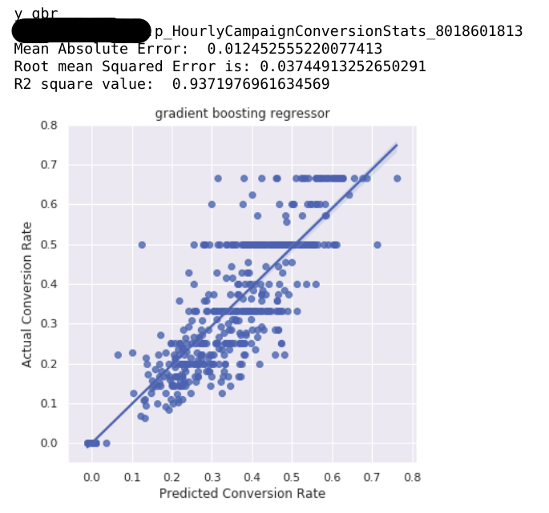
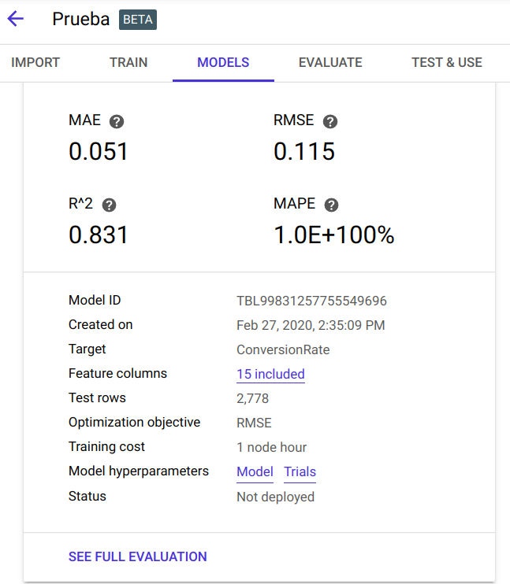
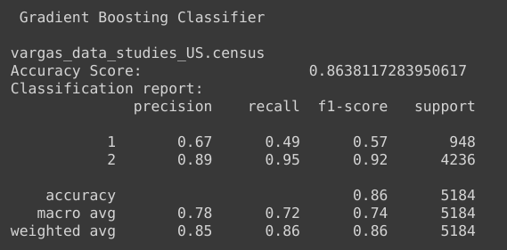
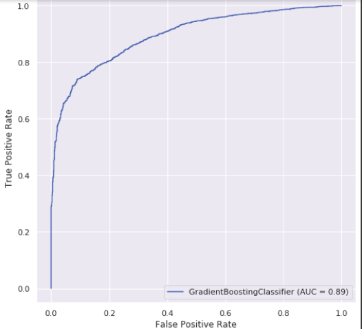

## Personal research about pros and cons of ML with Python, with BigQuery and Google AutoML for markech purposes.

------------------
---------------------

There are 2 cases to compare: Regression and classification algorithms.

    In addition to the final scores, in /src are available the files to create the models with the mentioned tools. 

----------------------
--------------------------

**Python**: I got the best metrics with it, not unusual because the dataset cleaning can be extremely well done and there are almost an infinite number of available algorithms to play with. 

- The cost is 0€.
- It can take many hours to build a great model.

**BigQuery**: The cleaning process can be quite uncomfortable. In spite of not being the most accurate, its performance can be valid, depending on your goal (four our case of studies, which is Martech it delivers acceptably).

- The cost is very low for our purposes (<1€/job).
- It take less time to build it than Python.
- It can be very easily implemented and programmed to run periodically in the GCS environment.

**AutoML**: Looks like an Excel, with limited room for manoeuvre. 

- The cost is quite high (~20€/job).
- It take almost 0hours to build it and lot of time computing the solution.
- It can be very easily implemented and programmed to run periodically in the GCS environment.
- Thanks to the interactive results, in classification problems you can modify the parameters to fit better your purposes.

A very interesting point is that 3 tools can be combined to enhance results.

----------------------
--------------------------

# Regression

A comparison of Python, Google Bigquery and Google AutoML  metrics for Machine Learning. 

This is just a test research with a Google Ads table from a private company. The goal is to predict the Conversion Rate column (the probability of a potentially customer finally performing the action we want (buying, visiting a webpage, watching a video... etc)). The Conversion Rate is a probability, a number, for this reason we chose this label and applied a regression algorithm (it can be a classification problem if planned in other way). 

Again, this is just a test, and if customers have Google 360 we can perform really useful and accurate predictions, like all constantly mentioned in GCS webpages.

- **Python**.

After testing many algorithms and hyperparameters, this is the best one:

- **BigQuery**.

BigQuery does not offer such a variety of algorithms to work with.

        After a 1st trial, this are the results. It is compulsory a better "cleaning" (selecting in SQL) to improve the metrics. I certainly did not perform all steps that I did with Python.
        Checking on the internet, it looks like BigQuery ML is not the best anyway, nevertheless there is an interesting margin of improvement here.

- **AutoML**

Once the model is done there is available a tuning of hyperparameters that can we not forget.
        
        Again, there is a margin of improvement that must be researched.

-----------------------------------------------------
----------------

# Classification

For this study we have chosen a public dataset, the `bigquery-public-data.ml_datasets.census_adult_income`.

The goal is to predict if the people make >50k$/year or less. So it is a binary classification with 2 options.

This kind of studies are really useful and can be used to predict purchases: This customer_id will/will not buy?

For this kind of algorithms there are a lot of metrics to take into account, depending on the distribution of data and what is our final goal, so all of them are presented here, and for future problems we will decide which ones fits better our purposes.

Going back to the census, which is a quite clean dataset, this are the final metrics for each Tool:

**Python**.

From all done algorithms (11), this is the selected one:

- BigQuery

        Metrics worse than with Python, but still acceptable. AUC is quite good.

- AutoML

        Remember there is available the tunning of hyperparameters (blue circle) to modify the metrics and implement the selected configuration to work with it.

----------------------

# Conclusions:

To conclude, the best metrics are not necessary the best solution. It will depend on customer, amount of data to ingest periodically, kind of cloud storage and requirements. 