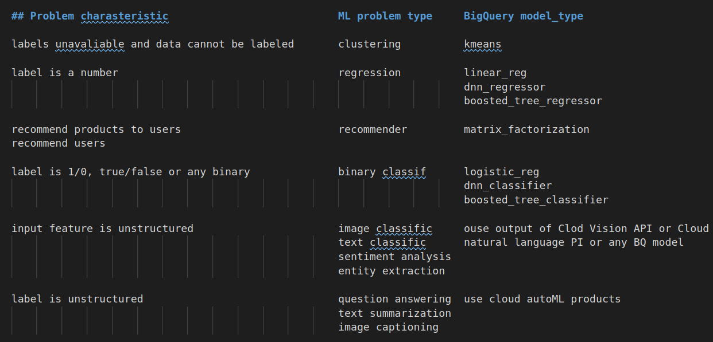

# 1st things 1st. Basics.

- Regression

    when the label is a number, like estimating the number of tickets that would be sold for a particular movie

- classification

    categorical variables. The probability that a row belongs to a label value.

    - binary classification problems: would buy or wouldn't? 0 or 1
    - multiclass:   the ouput will be a set of probabilities and the sum of them will be 1

- recommender

    it can be done without ml. recommender systems are also the preferable way to address customer targeting problems (to find customers who will like a product or promotional offer)

- clustering

    if we don't have a label at all and we need to do Unsupervised ML

- unstructured data

    we always assume our data consists of structured or semmistructured data. if some of the input features are unstructured (images or natural language text) we should use  Cloud Vision API or Cloud Natural Language 

    ------------------------------------------

    

-------------------------------