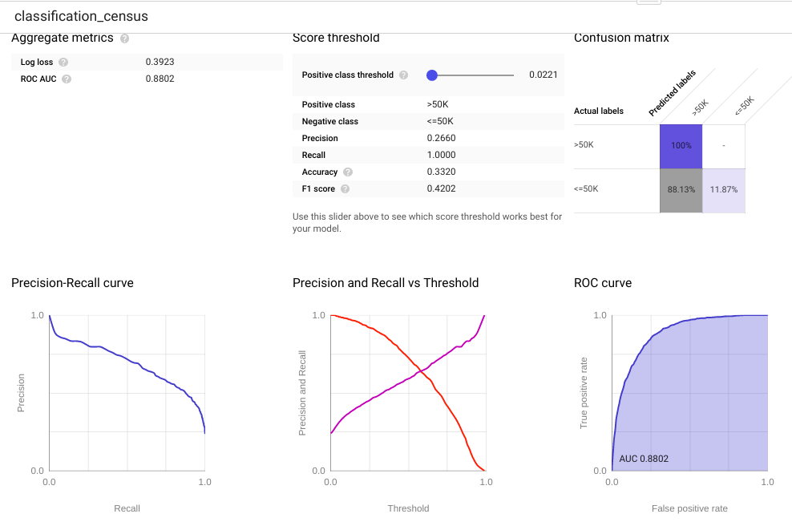
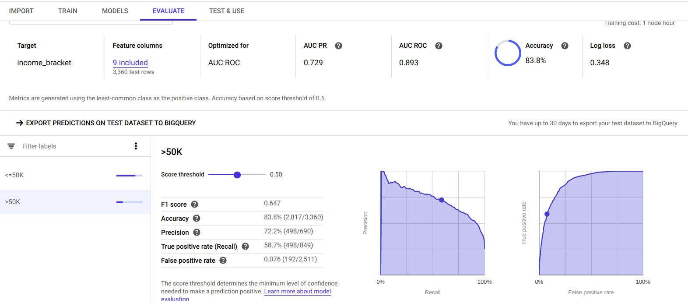
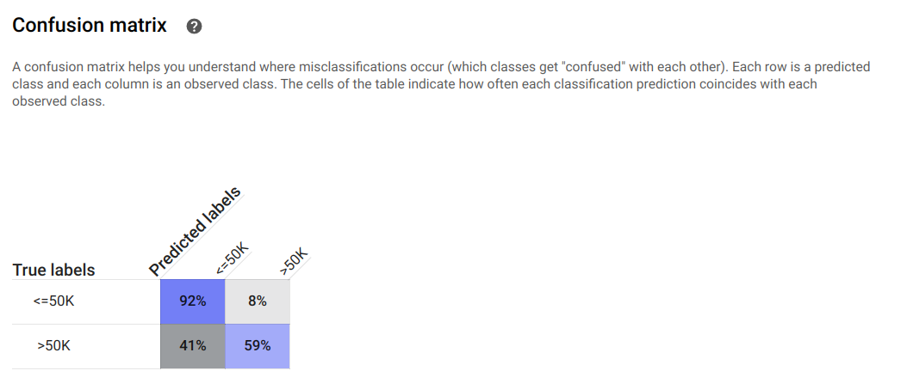
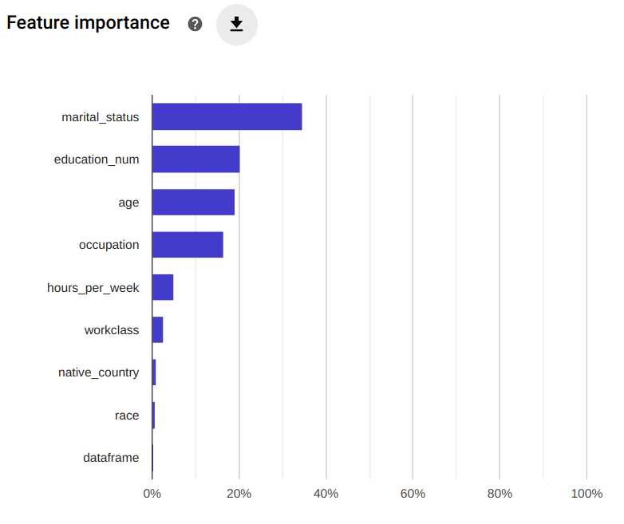

### Working with the Google census dataset

- copy the dataset you want to work to a personal place

- go here 
        https://console.cloud.google.com/automl-tables/datasets

- import data from BigQuery (fill the gaps)

    - isentropic-road-260315
    - foldername (because country stuff)
    - census

Once the data is imported

- select the label

- you can select additional parameters (column weights and stuff)

- Training

        Training budget 1h
        Feature columns: all columns (exactly like in BigQuery)

