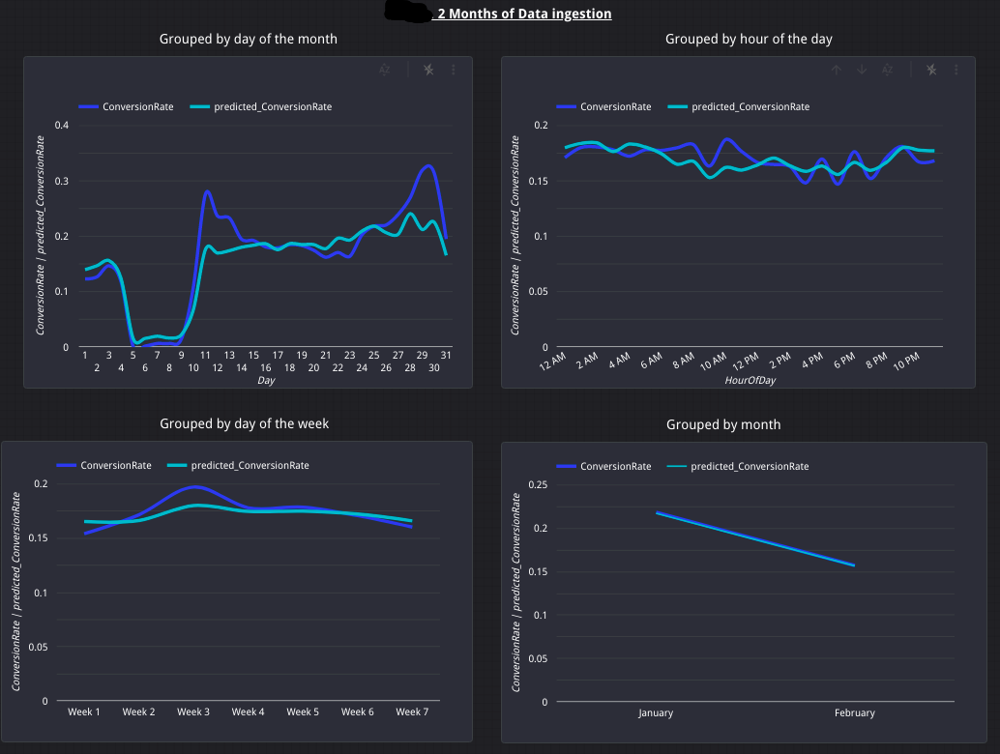

# ML regression with Bigquery

- This kind of regression algorithms is very useful when we have collected all data from a customer, nevertheless if a customer does not store the right parameters we are blind (for this reason Google 360 is so useful).

I already discarded the columns through Python, but we could do something like the following:

## Creating the model

        CREATE OR REPLACE MODEL
        `projectid.dataset.tabletoplaywith_vargas_regression` OPTIONS (model_type="linear_reg",
            labels=["ConversionRate"]) AS
        WITH
        params AS (
        SELECT
            1 AS train,
            2 AS eval)
        SELECT
        EXTRACT(DAY
        FROM
            Date) AS Day,
        EXTRACT(dayofweek
        FROM
            Date) AS DayOfWeek,
        EXTRACT(month
        FROM
            Date) AS Month,
        ConversionTrackerId,
        AdNetworkType1,
        AdNetworkType2,
        ConversionAttributionEventType,
        ConversionCategoryName,
        ConversionRate,
        ConversionTypeName,
        ConversionValue,
        CostPerConversion,
        HourOfDay,
        ValuePerConversion
        FROM
        `projectid.dataset.tabletoplaywith`

- In theory, we could use dnn_regressor and boosted_tree_regressor. It looks like Google changed its procedures and we will need to check tensorflow statements for other algorithms.

## Evaluate the model

With this we have all metrics. For some reason what Google tutorials recommend is to minimize the mean_absolute_error. They do not mention r2_score.

        SELECT
        *
        FROM
        ML.EVALUATE(MODEL `projectid.dataset.tabletoplaywith_vargas_regression`)

## Prediction

        SELECT
        *
        FROM
        ML.PREDICT(MODEL `projectid.dataset.tabletoplaywith_vargas_regression`,
        (SELECT
        ConversionRate,
        EXTRACT(DAY
                FROM
                    Date) AS Day,
                EXTRACT(dayofweek
                FROM
                    Date) AS DayOfWeek,
                EXTRACT(month
                FROM
                    Date) AS Month,
                ConversionTrackerId,
                AdNetworkType1,
                AdNetworkType2,
                ConversionAttributionEventType,
                ConversionCategoryName,
                ConversionTypeName,
                ConversionValue,
                CostPerConversion,
                HourOfDay,
                ValuePerConversion
        from
        `projectid.dataset.tabletoplaywith`
        ))

## Results

- We have collected data from just 2 months, which is not good (again, this is a test).

1. Grouping by month:
    From 0.25 Conversion Rate the results start to be different from the desired ones. It really makes no sense to group in this way, unless you have years and years of collected data.

2. Grouping by hours of day.

3. Grouping by day of the week. It looks like on wednesday predictions are different from the rest of days (wednesday-thursday).

4. Grouping by month we'll have an awesome prediction. The possible cause could be like locally the predictions are not good, but globally they perform good in the end.

https://datastudio.google.com/u/0/reporting/1awkU_GPtZBy13oRX21c2fIo1NOigrJ9j/page/pgZGB/edit

